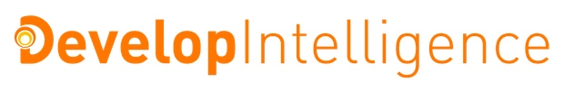

# Welcome to Introduction to GraphQL

Now more than ever, enterprise environments must support their tech & L&D priorities by delivering hyper-focused and targeted learning programs that work for each individual company, flawlessly.

The largest and most successful enterprise companies trust DevelopIntelligence to advance their tech learning environments. Let us show you what we can do for the success of your programs.

DevelopIntelligence Delivers.

## Class Information Page

[https://www.t4d.io/developintelligence-introduction-to-graphql-10262020](https://www.t4d.io/developintelligence-introduction-to-graphql-10262020)

## Other Resources

The instructor will distribute additional private links during class for downloading the recordings...

All code in this repository is distributed under the [MIT license](license.txt).

  
All course content and teaching is provided by: 
